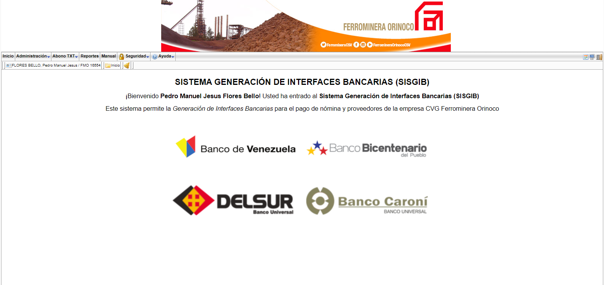
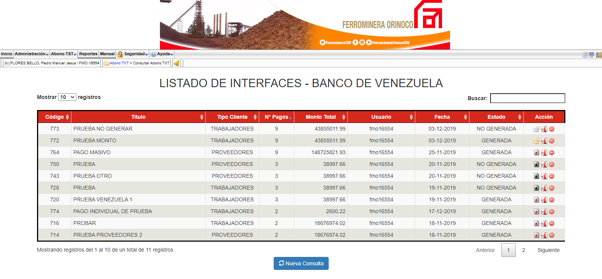

# Project Name

SISGIB (Sistema Generación de Interfaces Bancarias) / (Bank Interfaces Generation System)

## Project Description

System that is used for generating the batch text file (.txt) to load it on the company's bank for paying payroll

## Technologies

- Zend Framework 1.12
- PHP
- HTML
- CSS
- PostgreSQL

## Screenshots

Here are some screenshots of the project:

You can find more screenshots in the "screenshots" folder of this repository.